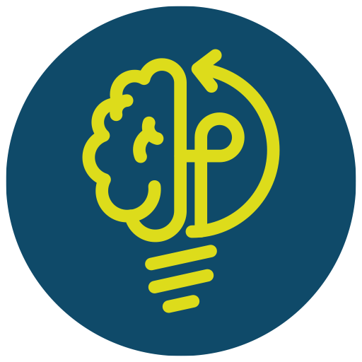

  

<h1 align="center">Mauricio Rodríguez</h1>

Leading Digital Transformation & Automation | Senior Project & Product Manager

---

## Executive Profile

I drive enterprise-wide transformation programs aligning business strategy, technology modernization and secure digital ecosystems in regulated financial environments.

My focus goes beyond building technology — I architect scalable digital ecosystems that connect business strategy, risk management and engineering execution.

I am deeply driven by innovation and continuous change, with a strong interest in advancing AI-driven initiatives within high-performance, international environments where technology creates measurable impact.

Currently pursuing a Master's in Artificial Intelligence.

---

## Strategic Leadership Domains

- Digital Banking & Payment Ecosystems
- AI-Driven Automation (OCR, KYC, Intelligent Onboarding)
- Identity & Security Architecture (SSO, Secure Integrations)
- Enterprise Platform Modernization (ERP, BPM, CMS)
- Cloud Transformation (Oracle OCI)
- Cross-Functional Transformation Programs

---

## Selected Enterprise Initiatives

- Digital Mastercard Launch
- Enterprise Payments & Gateway Integration
- AI-based Document Validation Framework
- Cloud Migration Strategy to Oracle OCI
- Engineering Productivity & AI Enablement

---

## AI Innovation & Strategic Exploration

- Applied research in Machine Learning and intelligent automation.
- Development of AI prototypes for document validation and onboarding optimization.
- Exploration of AI-driven transformation opportunities in regulated industries. 

---

## Professional Philosophy

Technology is a strategic enabler, not an isolated function.

I lead transformation programs where product strategy, architecture and execution converge to deliver measurable business outcomes. My decisions are grounded in clear trade-offs and KPI-driven prioritization, ensuring that every initiative creates durable value.

I build high-performance cultures centered on trust, ownership and accountability — where operational speed and engineering quality define the standard.

---

## Connect

LinkedIn: www.linkedin.com/in/mauricio-r-14201a190
Email: jmrodrigez.a@gmail.com

